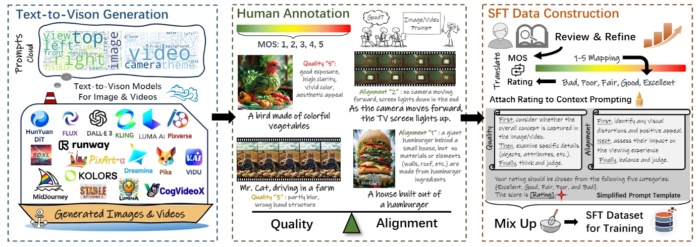
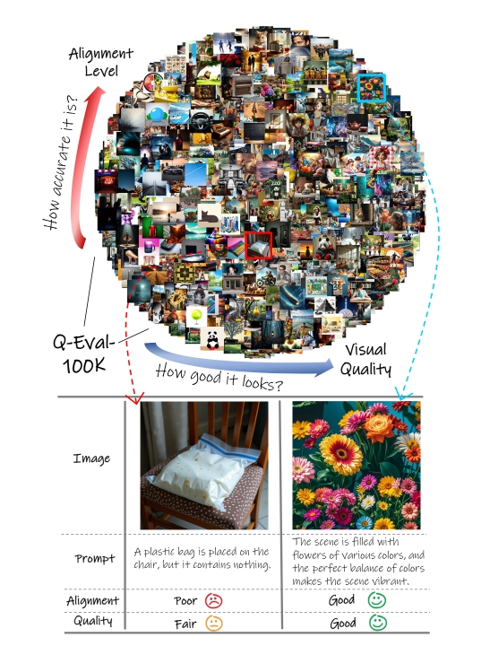
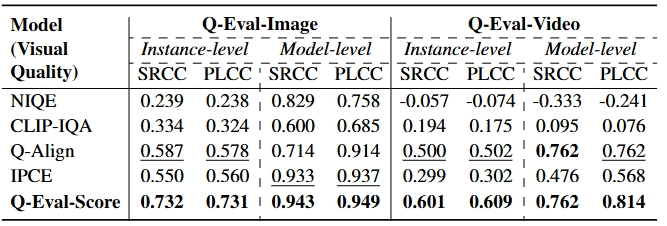
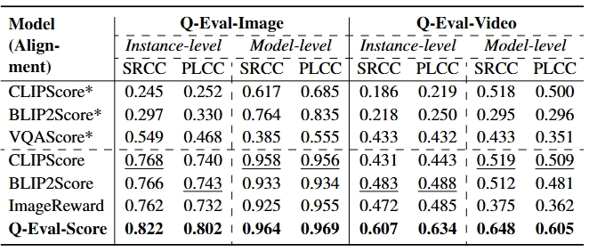

<div align="center">
  <h1>Q-Eval-100K: Evaluating Visual Quality and Alignment Level for Text-to-Vision Content</h1> 
  
<div style="width: 100%; text-align: center; margin:auto;">
      
</div> 

  <div>
      <a href="https://zzc-1998.github.io/" target="_blank">Zicheng Zhang</a><sup>1</sup>,
      <a href="" target="_blank">Tengchuan Kou</a><sup>1</sup>,
      <a href="" target="_blank">Shushi Wang</a><sup>1</sup>,
      <a href="" target="_blank">Chunyi Li</a><sup>1</sup>,
      <a href="" target="_blank">Wei Sun</a><sup>1</sup>,
      <a href="" target="_blank">Wei Wang</a><sup>2</sup>
  </div>
  <div>
      <a href="" target="_blank">Xiaoyu Li</a><sup>2</sup>,
      <a href="" target="_blank">Zongyu Wang</a><sup>2</sup>,
      <a href="" target="_blank">Xuezhi Cao</a><sup>2</sup>,
      <a href="" target="_blank">Xiongkuo Min</a><sup>1</sup>,
      <a href="https://jhc.sjtu.edu.cn/~xiaohongliu/" target="_blank">Xiaohong Liu</a><sup>1</sup>,
      <a href="https://ee.sjtu.edu.cn/en/FacultyDetail.aspx?id=24&infoid=153&flag=153" target="_blank">Guangtao Zhai</a><sup>1</sup>
  </div>
  <div>
  <sup>1</sup>Shanghai Jiao Tong University, <sup>2</sup>Meituan
</div>   

Paper Available at [Arxiv](https://arxiv.org/abs/2503.02357).

Dataset is now available at [HF](https://huggingface.co/datasets/AGI-Eval-Official/Q-Eval-100K). Only the training instances are open-sourced.

The retrained Q-Eval-Score weight on the training instances is at [https://huggingface.co/AGI-Eval-Official/Q-Eval-Score](https://huggingface.co/AGI-Eval-Official/Q-Eval-Score)

Q-Eval serves as the dataset for the [NTIRE 2025 XGC Track 2](https://codalab.lisn.upsaclay.fr/competitions/21485).


## Motivation
<div style="display: flex; align-items: center; width: 100%;">
  <div style="width: 50%; text-align: center;">
    
  </div>
  <div style="width: 50%; text-align: left; padding-left: 20px;">
   Evaluating text-to-vision content hinges on two crucial aspects: visual quality and alignment. While significant progress has been made in developing objective models to assess these dimensions, the performance of such models heavily relies on the scale and quality of human annotations. According to Scaling Law, increasing the number of human-labeled instances follows a predictable pattern that enhances the performance of evaluation models.
    Therefore, we introduce a comprehensive dataset designed to Evaluate Visual quality and Alignment Level for text-tovision content (Q-EVAL-100K), featuring the largest collection of human-labeled Mean Opinion Scores (MOS) for
the mentioned two aspects. 
    The Q-EVAL-100K dataset encompasses both text-to-image and text-to-video models, with 960K human annotations specifically focused on visual quality and alignment for 100K instances (60K images and
40K videos). 
    Leveraging this dataset with context prompt, we propose Q-Eval-Score, a unified model capable of evaluating both visual quality and alignment with special improvements for handling long-text prompt alignment. Experimental results indicate that the proposed Q-Eval-Score achieves superior performance on both visual quality and
alignment, with strong generalization capabilities across other benchmarks. 
    These findings highlight the significant value of the Q-EVAL-100K dataset.
  </div>
</div>


<h2>Visual Quality Performance</h2> 
<div style="width: 50%; text-align: center; margin:auto;">
      
</div> 

<h2>Text Alignment Performance</h2> 
<div style="width: 50%; text-align: center; margin:auto;">
      
</div> 


<div align="left">
<h2>Dataset Access</h2> 

The training dataset is available at [HF](https://huggingface.co/datasets/AGI-Eval-Official/Q-Eval-100K).

<h2>Model Release</h2>

Due to the Meituan copyright policies, currently we are not allowed to release the Q-Eval-Score model.

However, to support the research community, we have **re-trained the model from scratch using the public part of Q-Eval data only**. The weights of this fully open-source version are now available on Hugging Face:

👉 [https://huggingface.co/AGI-Eval-Official/Q-Eval-Score](https://huggingface.co/AGI-Eval-Official/Q-Eval-Score)

We hope this model can serve as a starting point for building strong and explainable visual evaluators.

## 💻 Inference

We provide a Python script [`infer.py`](./utils/infer.py) for running inference using the open-source Q-Eval-Score model.

## Citation

If you find our work useful, please cite our paper as:
```
@misc{zhang2025qeval100kevaluatingvisualquality,
      title={Q-Eval-100K: Evaluating Visual Quality and Alignment Level for Text-to-Vision Content}, 
      author={Zicheng Zhang and Tengchuan Kou and Shushi Wang and Chunyi Li and Wei Sun and Wei Wang and Xiaoyu Li and Zongyu Wang and Xuezhi Cao and Xiongkuo Min and Xiaohong Liu and Guangtao Zhai},
      year={2025},
      eprint={2503.02357},
      archivePrefix={arXiv},
      primaryClass={cs.CV},
      url={https://arxiv.org/abs/2503.02357}, 
}
```

</div> 
